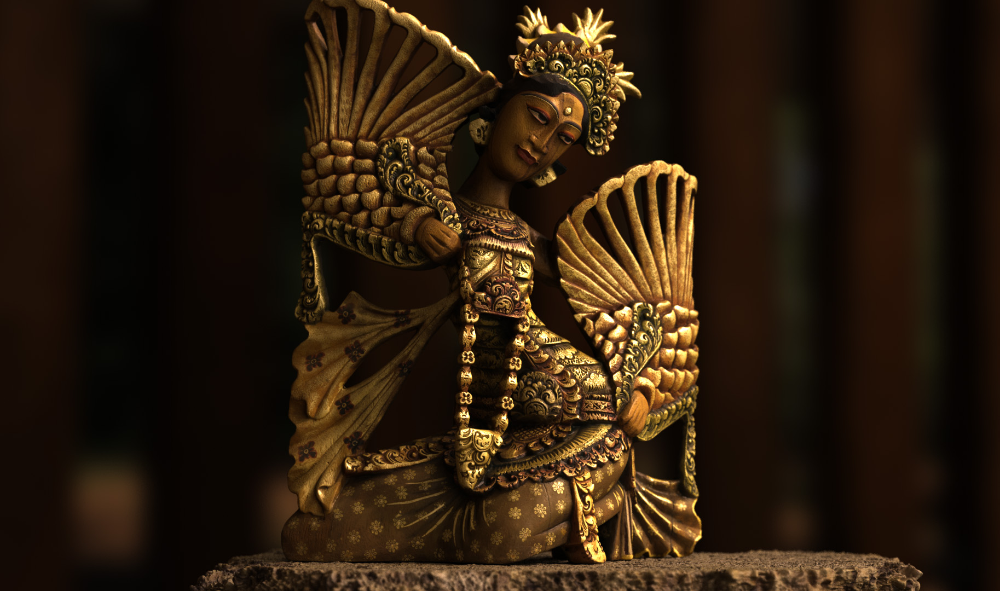

# Problem and Solution

## The Traditional Method Problems

The traditional creation of 3D models requires a complex pipeline, which starts with research and conceptual design, goes through 3D modeling and then texturing, where colors and details are added.

### Specialized Workforce

Need for highly specialized professionals to create Metaverse, AR, VR, VFX and Game content.

### Slow and Expensive

Creation process with hundreds of artists and dedicated software licenses in a back-and-forth workflow.

### Lack of Reality

Lack of realistic 3D objects on the industry and creative professionals doing non-creative jobs.

### Not Web3 Compatible

Traditional trading method not compatible with metaverse, NFT blockchain and crypto.

## The Solution

An ecosystem that generates and provides 3D scanned content for Metaverse, VFX and Game producers, able to save time and money to decentralize the AAA content.

### Simplified Pipeline

Producers just download and put the 3D models in their projects.

### Ready to Use

Cost-effective subscription model that gives access to ready to use 3D assets, compatible with all industry default softwares.

### Maximum Realism

Capture, automated 3D generation using photogrammetry and delivery standard with micro details focus and rich topology, aiming for the maximum accuracy to the real object.

### Built for the Web3

Token and NFTs with true real world use purpose and usability within the ecosystem.

