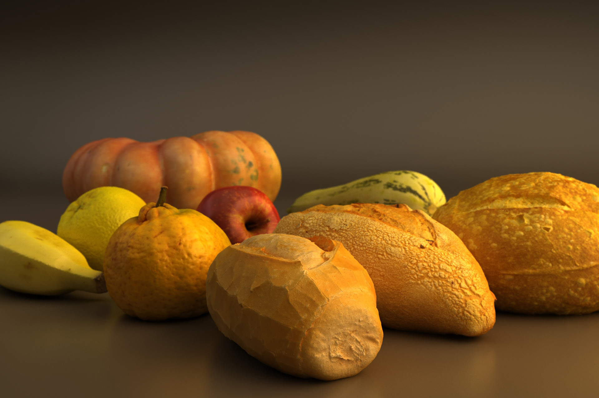

# What is Photogrammetry?

Photogrammetry is a 3D recording technique that employs multiple overlapping photographs and deriving measurements from them to create a 3D model of an object or surface.

**Photogrammetry** is the science and technology of obtaining reliable information about physical objects and the environment through the process of recording, measuring and interpreting photographic images and patterns of electromagnetic radiant imagery and other phenomena.

Photogrammetry uses methods from many disciplines, including optics and projective geometry. Digital image capturing and photogrammetric processing includes several well defined stages, which allow the generation of 2D or 3D digital models of the object as an end product.

Photogrammetry is used extensively to combine live action with computer-generated imagery in movies post-production and to create photorealistic environmental assets for video games and metaverse projects.

It is also used in fields such as topographic mapping, architecture, engineering, manufacturing, quality control, police investigation, cultural heritage, and geology. Archaeologists use it to quickly produce plans of large or complex sites, and meteorologists use it to determine the wind speed of tornados when objective weather data cannot be obtained.

